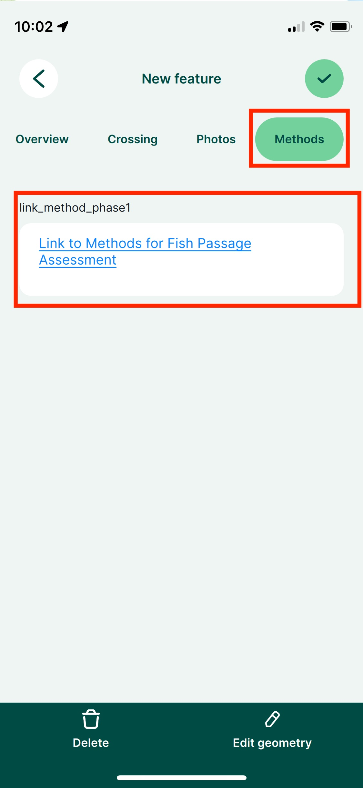
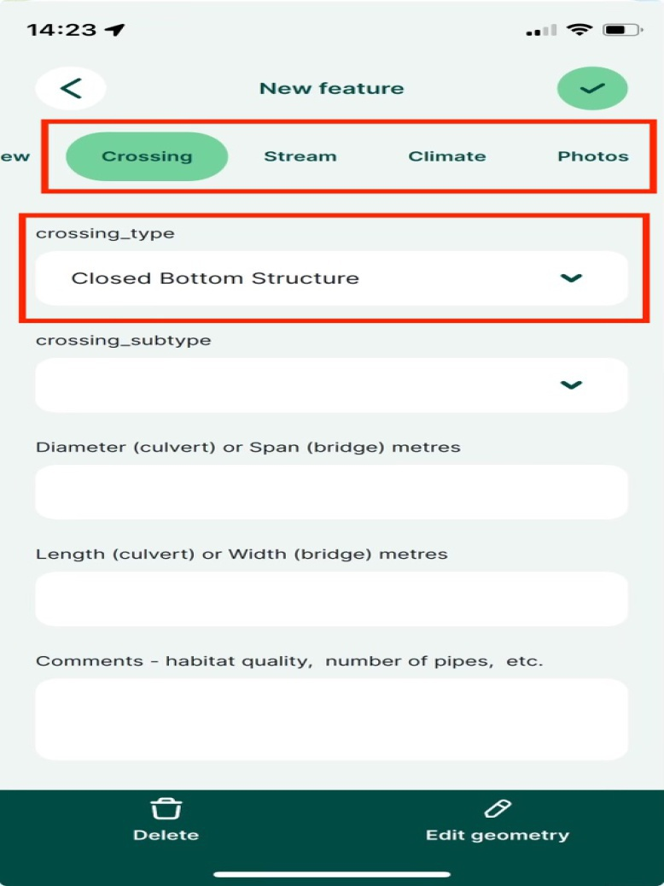
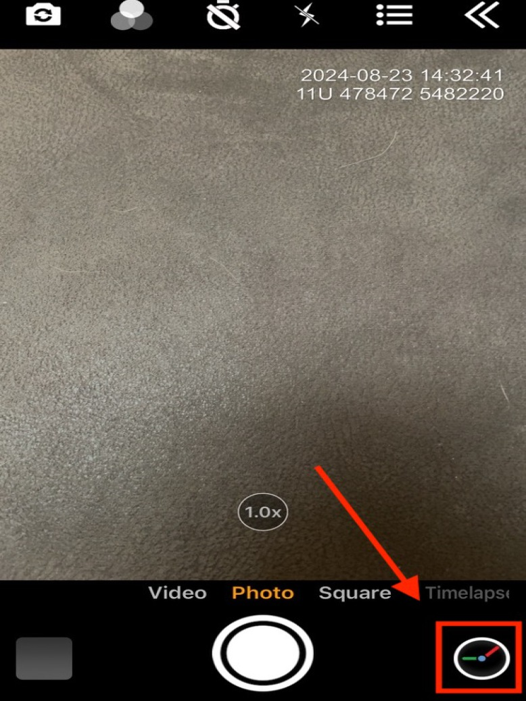
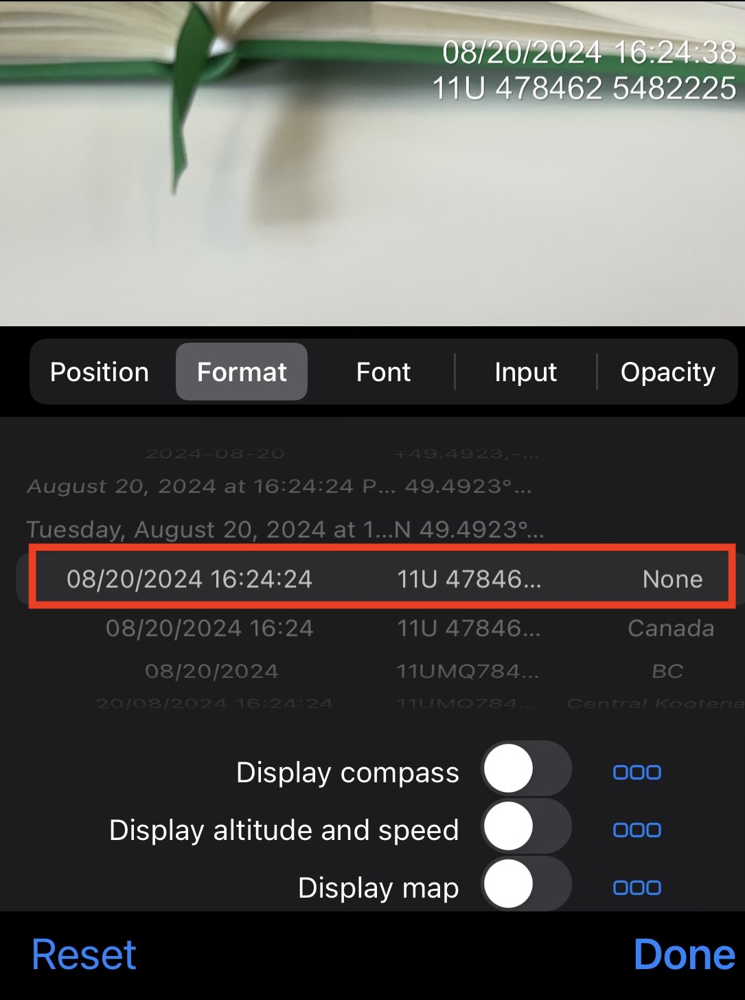
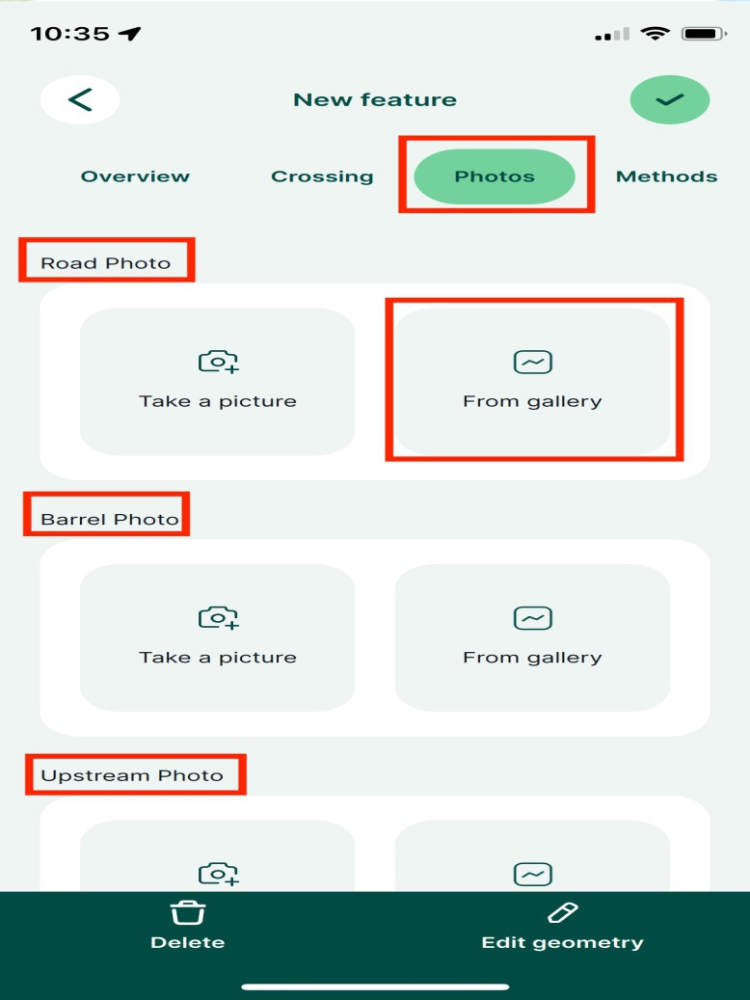
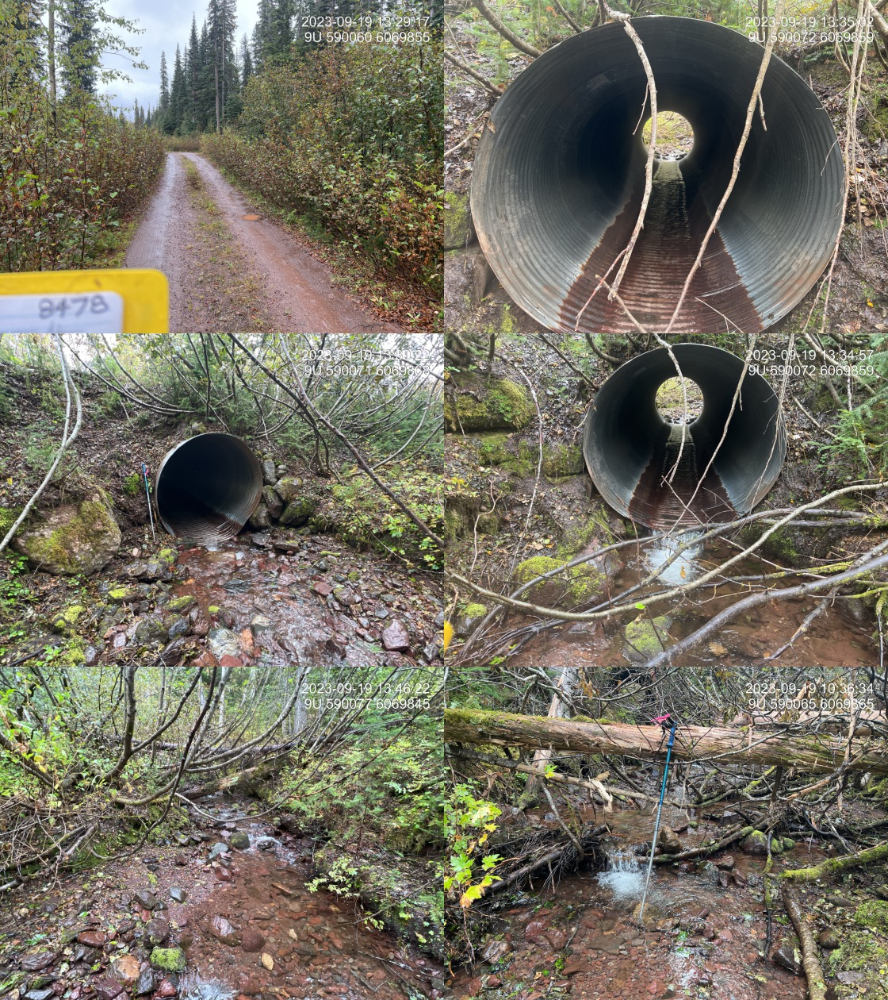

# Data Collection and Field Navigation

## Methods

### Fish Passage {-}

In the field, crossings are assessed for fish passage following the procedures outlined in [Field Assessment for Determining Fish Passage Status of Closed Bottomed Structures](https://www2.gov.bc.ca/assets/gov/environment/natural-resource-stewardship/land-based-investment/forests-for-tomorrow/field-assessment-for-determining-fish-passage-status-of-cbs.pdf) [@fish_passage_assessments]. 

<br>

We have developed a digital field form called `Form PSCIS` (an adapted version of the [Field Assessment for Determining Fish Passage Status of Closed Bottomed Structures](https://www2.gov.bc.ca/assets/gov/environment/natural-resource-stewardship/land-based-investment/forests-for-tomorrow/field-assessment-for-determining-fish-passage-status-of-cbs.pdf) [@fish_passage_assessments] that can and should be used to collect this data in the field. Our digital field form is our primary tool for data collection and contains a high level of detail, however its still undergoing development, so we are currently minimally populating a paper form as well to ensure we have the data in case of a digital failure.

<br>

In addition to the methods mentioned above, here are some important things to note when collecting data:

* When measuring channel width and stream gradient, take measurements upstream of crossing because this is the habitat that will be gained if remediation occurs. Take measurements outside of the road corridor, take the average of three channel widths and a slope in the longest possible section. 
* When filling in the paper form, record crew members and circle the initials of the person who's GPS was used to record the crossing location. This avoids confusion in the data management stage. 
* For culvert crossings with multiple pipes installed at the same elevation at the outlet, add the diameters together and make a note in the comments that it was 2 pipes. Don't add the diameters together if the second pipe is an overflow pipe, which is usually installed above the main culvert in case of an overflow event. This is because the diameter of the pipes is used to estimate the crossings flow capacity under normal conditions, not during an overflow or flood event.
* If there are associated `MoTi Chris Culvert ID`s or `MoTi Major structures` (Ministry of Transportation and Infrastructure's own culvert tracking system) we include those in the `MoTi Chris Culvert ID` fields, found in the `Overview` section of the form. To view these structures on the map, you can find the `MoTi Culverts` and `MoTi major structures` layers in the `Crossings` group, which can be turned on with the `High Detail - Crossings` theme or by hand.  The `MoTi Culverts` layer can be helpful for finding crossings that land in spots not located as mapped.
* If the crossing is an obvious barrier and the stream habitat appears high value, make a note that this location could be a high priority for follow up and a habitat confirmation.

<br>

Always collect all the information, including the photos, so that we have what we need. If you don't collect some information then write in the assessment comments why it is missing. For example, if you cannot see the inlet of the culvert, take a picture of what you can see and upload it to Mergin then explain in the assessment comments that the inlet was not visible. Same with fields you are not sure of, fill everything out and put details in the assessment comments of what is going on.
 

<br>

There is a link to the [Field Assessment for Determining Fish Passage Status of Closed Bottomed Structures](https://www2.gov.bc.ca/assets/gov/environment/natural-resource-stewardship/land-based-investment/forests-for-tomorrow/field-assessment-for-determining-fish-passage-status-of-cbs.pdf) [@fish_passage_assessments] methods in the digital field form so you can easily access them while in the field if you have cell service (Figure \@ref(fig:methods-mobile)). 

```{r methods-mobile, fig.cap = "The methods used for fish passage assessments can be found in the 'Form PSCIS' under 'Methods'", out.width='50%', eval=T}

```

<br>

### Habitat Confirmations {-}

When a site looks like a promising candidate for replacement, we will do a more thorough assessment called a Habitat Confirmation following the guidelines outlined in [A Checklist for Fish Habitat Confirmation Prior to the Rehabilitation of a Stream Crossing](https://www2.gov.bc.ca/assets/gov/environment/natural-resource-stewardship/land-based-investment/forests-for-tomorrow/checklist-for-fish-habitat-confirmation-201112.pdf) [@fishpassagetechnicalworkinggroup2011ChecklistFisha], and [FHAP Procedures](https://www2.gov.bc.ca/assets/gov/environment/natural-resource-stewardship/nr-laws-policy/risc/recce2c.pdf) [@resourceinventorystandardscommittee2001Reconnaissance20]. 

<br>

We use our digital field form called `Form Fiss Site` to record habitat data, which is an adapted version of the [FISS Site Card](https://www2.gov.bc.ca/assets/gov/environment/natural-resource-stewardship/nr-laws-policy/risc/scf.pdf) [@ministryofenvironment2001SiteCarda] and includes methods from the [FISS Site Card Field Guide](https://www2.gov.bc.ca/assets/gov/environment/natural-resource-stewardship/nr-laws-policy/risc/sitecard20.pdf) [@ministryofenvironment2008Reconnaissance20a]. In addition to the above methods, here are some important things to note when conducting a Habitat Confirmation:

  * In the `Form Fiss Site` under `Site Name`, record the `PSCIS Crossing ID` or `Modelled ID` (see [Site Identification] to determine which one) followed by an underscore and `us` or `ds`, indicating if the survey was done upstream or downstream of the crossing (ex: `12345_us`). 
  * Ensure **at least** three wetted and channel widths are taken, but aim for 5-6.
  * Using your GPS, mark a waypoint at the bottom of your site and record the site length by measuring the distance between the start and end of survey.
  * Survey upstream of crossing for a minimum of 600m, and downstream a minimum of 300m.
  * Take lots of photos using Timestamp. Photograph features/obstacles if present, gravels, pools, or any other photos of the stream that will help tell the story. Put a walking pole in your picture to help get an idea of the scale. Include your boot in gravel pictures for scale. 
  * Make sure to record comments regarding:
      - stream habitat
      - presence of natural barriers 
      - fish sightings 
      - presence of spawning gravels
      - presence of deep pools 

<br>

### Fish Sampling {-}

Fish sampling is conducted at sites when biological data is considered to add significant value to the physical habitat assessment information. We use the `Form Fiss Site` at fish sample sites to record habitat data. Additionally, we also fill out a paper Fish Site card to record electrofisher settings and individual fish information.

<br>

Most often we utilize electrofishing for fish sampling and follow the standards and procedures found in [Fish Collection Methods and Standards](https://www2.gov.bc.ca/assets/gov/environment/natural-resource-stewardship/nr-laws-policy/risc/fishml04.pdf) [@resourcesinventorycommittee1997FishCollection] and [Reconnaissance (1:20 000) Fish and Fish Habitat Inventory Manual](https://www2.gov.bc.ca/assets/gov/environment/natural-resource-stewardship/nr-laws-policy/risc/recce2c.pdf) [@resourcesinventorycommittee2001Reconnaissance20a].

<br>

 We use the [Field Key to Freshwater Fishes of BC](https://www2.gov.bc.ca/assets/gov/environment/natural-resource-stewardship/nr-laws-policy/risc/field_key_to_freshwater_fishes_of_bc_field_size_water_resistant_version.pdf) [@mcphail_carveth1993FieldKey] to identify fish.

<br>
 
In the `Form Fiss Site`, here are some things to take note of:

  * In the form under `Site Name`, record the `PSCIS Crossing ID` or `Modelled ID` (see [Site Identification] to determine which one) followed by an underscore and `us` or `ds` and `_ef#` indicating if the site is upstream or downstream and what the sample site number is (ex: `12345_us_ef1`).
  * Fill out a new `Form Fiss Site` and paper habitat site card for every electrofishing site. At minimum, the following data should be recorded at each site:
      - site start and end locations (with GPS and flagging tape)
      - site length
      - water quality (temperature, conductivity, turbidity, and pH)
      - stream wetted widths (at least 3)
      - habitat comments
    
<br>

On the paper Fish Site card:

  * Record the electrofisher settings, including the voltage, frequency, and seconds elapsed during each sample site.
  * Record if the site was enclosed (stop nets at boths ends), partially enclosed (stop net at one end), or open (no stop nets).
  * For each fish, record the species, fork length in millimeters, and weight. 
  * Most fish that are over 60mm long also get a PIT tag, see the section below on [PIT Tagging]. When recording the `PIT tag ID`, record the complete tag ID for the first fish and then only record the last 3 digits/letters for the rest. This is because only the last 3 digits/letters change within the same box of tags, so we can save time by just recording the last 3. When you open a new box of PIT tags, don't forget to record the complete tag number again!  
  * Also record the PIT `tag row ID` for each fish. 
  * Take photos of fish using the Timestamp app, and record the exact time of the photo on the Fish Site card. This will make it easier to identify fish later on. If unable to identify the species, it is important to take a photo and review field id guides later.  
 
 <br>

### PIT Tagging {-}

Fish with a fork length greater than 60 mm and belonging to species approved under the scientific fish collection permit for the given project are tagged with Passive Integrated Transponders (PIT tags) using the [Abdominal Cavity](https://www.youtube.com/watch?v=9CKZ9yaS5o8) method outlined by Biomark.

<br>

Pit tagging can be harmful to fish if done incorrectly. We want to do our best job so fish get tagged as safely as possible. Please read these instructions thoroughly:

  1. To anesthetize fish prior to pit tagging, we use a solution of approximately 0.1 mL of clove oil per 1 L of water (1:10,000). This concentration was selected for its efficiency in providing effective sedation with minimal residual effects, making it ideal for studies in which fish are released back into their natural habitats [@fernandes_etal2017efficacyclove]. The clove oil solution should be prepared in advance by dissolving pure clove oil in ethyl alcohol in a 1:9 ratio (clove oil: ethyl alcohol) to enhance solubility, then mixed into the water bucket [@fernandes_etal2017efficacyclove]. 
  
  2. Place fish into the bucket with clove until they have reached an appropriate level of anesthesia for handling. Be mindful of how long the fish remain in the clove bucket. If you have a large number of fish, only place half or a third of them in the bucket at a time, or even fewer if you're still learning to tag fish and need extra time.
  3. Ensure the needle is loaded with a tag before grabbing the fish, then insert the PIT tag following the instructions outlined in the [Abdominal Cavity](https://www.youtube.com/watch?v=9CKZ9yaS5o8) methods. Be very careful when handling the needle. Do not insert the needle too deep, but ensure the tag is inserted parallel to the body of the fish, just underneath the skin. 
  4. After tagging the fish, scan it with the PIT reader, and record the last 3 digits/letters of the `PIT tag ID` and the complete `tag row ID`. 
  5. Finally, place the fish into a bucket of fresh water where they can recover before being released back into the stream.
  6. Change out needles roughly every 10 fish, they will wear out and it will become more difficult to penetrate the skin, potentially causing injury to the fish. 
  
<br>

## Digital field forms 

We have developed several digital field forms that can and should be used to collect data in the field. The digital field forms are our primary tool for data collection and contains a high level of detail, however they are still undergoing development, so we are currently minimally populating a paper form as well to ensure we have the data in case of a digital failure.

<br>

Our digital field forms are built with QGIS and accessed through [Mergin Maps](https://merginmaps.com/), which is a geodata platform that allows us to collaborate with others by collecting data in the field and syncing to a shared QGIS project [@merginmaps2023mergin]. We also use the Mergin Maps app to view QGIS projects while in the field which allows us to locate sites and understand watershed/land values.  Check out the [Mergin Maps documentation](https://merginmaps.com/docs/) for more information.

<br>

We currently have 3 digital field forms:

  - `Form PSCIS` is used to for [Fish Passage] assessment data collection
  - `Form FISS Site` is used for [Habitat Confirmations] and [Fish Sampling] site data collection
  - `Form Monitoring` is used for Monitoring data collection (currently only found in certain project)

<br>

Once downloaded to a phone - wifi or cell service is not required to view maps and collect data. Also of note - it is not required to have the project downloaded on a laptop to see/use them on the phone - only a Mergin account with access to the `newgraph` workspace is necessary.

<br>

### Set up {-}

Setting up Mergin Maps on a phone requires a wifi or cell connection:

  1. Download the Mergin Maps app from the App Store (Apple) or Google Play (Android) following the [instructions here](https://merginmaps.com/docs/setup/install-mobile-app/). 
  2. Sign up for a "free trial" account. We suggest a username with no spaces (or special characters like %$&) such as "newgraph_lschick" as it tells us a lot just by the name. If you have already made a username for github and it has no spaces or special characters perhaps you just want to use that one. Sign in if you have an existing account.
  3. It will require you to make a FREE trial workspace. Once this is complete you will be able to access the `newgraph` workspace at no cost (even beyond the end of the free trial period).
  4. We will receive an invitation to join the `newgraph` Mergin workspace.
  5. Switch to the `newgraph` workspace following [these instructions](https://merginmaps.com/docs/manage/workspaces/#how-to-switch-between-workspaces).
  
<br>

### Using Mergin on a mobile device {-}

Although use in the field does not require wifi or cell service, there are actions that require an internet connection such as switching accounts, downloading projects from the cloud, synchronising changes to the cloud, and displaying online background maps (ex. google imagery). Use the following instructions to **download your projects before you head out into the field!**


  1. Navigate to the `Projects` tab following the [instructions here](https://merginmaps.com/docs/field/mobile-app-ui/#projects).
  2. Download the project you want to view. You will need at least 2GB of storage on your phone to download a project. Once downloaded, tap the project name to open.
  3. [View the different themes](https://merginmaps.com/docs/field/mobile-app-ui/#more-options-zoom-to-project-map-themes-position-tracking-local-changes-settings) available. 
  4. [View the available layers](https://merginmaps.com/docs/field/mobile-app-ui/#layers). You will only see one layer visible, `bcfishpass Mobile`, which contains all our layers grouped into categories. Click `bcfishpass Mobile` to view the categories, such as `Crossings`, `Forms`, `Project Specific`. Some category contains sub-categories, so have a look around to see all the available layers. Toggle a layer to turn it on or off on the map.
    For example, if you want to make the `streams_st` layer visible, you would navigate through `bcfishpass Mobile` → `Streams` → ` Habitat models`→ `streams_st` to toggle on `streams_st`.
  
  5. Know how to [exit](https://merginmaps.com/docs/field/mobile-app-ui/#more-options-zoom-to-project-map-themes-position-tracking-local-changes-setting) a Project.

<br>

### Field Data Entry into Mergin {-}
Follow the [instructions to add a feature to a specific layer](https://merginmaps.com/docs/field/mobile-app-ui/#add) and the
guidance below to add fish passage assessment data to `Form PSCIS`:

  1. Ensure you are at the location of the culvert before adding the feature to `Form PSCIS`. 
  2. Tap `record` at the bottom of the screen.
  3. Once the form appears you can enter the data. The form is divided into sections which you can see at the top of the screen. The `Stream` and `Climate` sections will only become visible if you have selected `closed bottom structure` for the  `crossing_type` because only closed bottom structures require that information. Navigate through each section to enter data.
  4. Click the green check mark in the top right corner to save the feature.
 
```{r sections-mobile, fig.cap = "The `Stream` and `Climate` sections will only become visible if you have selected `closed bottom structure` for the  `crossing type` ", out.width='50%', eval=T}

```

  5. While entering information save the form often as glitches can occur which can lead to loosing work.
  
  6. When you are no longer offline, **[make sure to sync](https://merginmaps.com/docs/field/mobile-app-ui/#sync) your changes** to the online shared project.

<br>

When adding features (sites) to the project map, here are some things to take note of:

  - We find that Mergin works much better (faster rendering) with *airplane* mode on. 
  
  - In addition to using the digital field forms (see above section), **make sure to fill out the paper copies as well** as in the past we have seen uncommon issues with syncing and data corruption.
  
  - Switching between themes can be very useful for seeing different levels of detail in the field. The most common theme when navigating to sites in the field is: `Low detail - {Species} Model` with other more detailed themes (ex. `High Detail - Crossings`) used when researching background information for the site (ex. species upstream, MoTi Culvert ID)

<br>

#### Site Identification {-}
  - The identification of each site is important for workflow data processing and necessarily a bit complicated.  It involves one of either `PSCIS Crossing ID` or a `Modelled ID`:

  1. If a site has a `PSCIS Crossing ID` (`stream_crossing_id` within the `Crossings - PSCIS assessment` layer)  then that is used as the identifier. 
    
  2. If there is no `PSCIS Crossing ID` we use the `Modelled ID` which is the `modelled_crossing_id` filed from the `Crossings - modelled` layer. 
  
  3. If there is neither a `PSCIS Crossing ID`  or a `Modelled ID` (rare but usually occurs when a stream is not mapped correctly) we use a numeric ID based on the date (YYYYMMDD01 - example 2023070502 - would be the second assessment by a field surveyor for the day). It is important to not have duplicate `Modelled ID`s so each surveyor should be assigned their own number series to append to the date for each day (ex. surveyor 1 has 1 - 49 and surveyor 2 has series 50 - 99).
  
<br>
  

#### Comments {-}

It's important to write detailed comments regarding the habitat in the `Comments - habitat quality, number of pipes, etc.` box found in the `Crossing` section of the form (Figure \@ref(fig:comments)). Comments should include everything that will help characterize the site and justify the habitat ratings given by the surveyor. Some example are:

- justification for habitat value rating (ex. good flow and some gravels present)
- the condition of the culvert/crossing
- observations of riparian health or deterioration and potential causes (cattle, erosion, stream velocity, etc)
- size, number and species (if known) of fish observed 
- local knowledge if applicable
- presence of potential natural barriers (ex: cascade or waterfall)
- location of the crossing if it was incorrectly mapped
- information regarding past restoration work
- priority for follow up
- adjacent landowner information if applicable. Is the landowner interested in collaborating or do they have valuable knowledge of the stream or crossing?
- reasons for photos taken are not ideal (ex. water too high to see the inlet so it is not clear in the photo)

<br>

There are also comment boxes in the `Climate` section of the form which are for climate-related notes regarding the condition of the crossing as well as the climate change risk and priority (Figure \@ref(fig:comments)). These comments are separate from habitat comments mentioned above and used for different purposes in the reporting phase so make sure to not mix these up. 

```{r comments, fig.cap = "Left: Place to write detailed comments regarding the habitat in the `Crossing` section of the form. Right: Place to write climate-related comments in the `Climate` section of the form.", fig.show="hold", out.width= c("49.5%","1%","49.5%"),}
knitr::include_graphics("fig/fieldwork/hab_comments.jpg")

knitr::include_graphics("fig/fieldwork/climate_comments.jpg")
```

  <br>
  
#### Photos {-}

Photos are one of the most important pieces of data we collect with the majority of which loaded to our digital field forms. The [Timestamp Camera app](http://www.timestampcamera.com/) is used to take photos (landscape only) in the field. 

<br>

Ensure the current date and time and UTM coordinates are in top right corner of the Timestamp app. Navigate to the Timestamp settings by pressing the 'clock' icon in the bottom right corner when in the timestamp app.


```{r timestamp-settings, fig.cap = "Left: Navigate to the Timestamp settings by pressing the 'clock' icon in the bottom right corner when in the timestamp app. Right: Use these Timestamp settings.", fig.show="hold", out.width= c("49.5%","1%","49.5%")}



```

<br>

Photos are taken at surveyed crossings and all **SIX** of the following images are always required: **road, crossing inlet, crossing outlet, crossing barrel, channel downstream and channel upstream of the crossing** (Figure \@ref(fig:photos-mobile)). We encourage taking enough photos to have a good understanding of the site, 6 is just the minimum. These photos really come in handy when we are back in the office and need to recall the site. 

<br>


The first photo you take should **always** be of the road with the `PSCIS Crossing ID` or the `Modelled ID` on the site card visible in the corner (or a photo of site card filled in with site name, date, stream name) (Figure \@ref(fig:road-photo)).  This allows for easier sorting of the photos later on back in the office. 

<br>

Take photos on your camera first, then add them to the digital field form in the `Photos` sections of the form, following the instructions below:

  1. Navigate to the `Photos` section of the digital field form
  2. You will see a place to add each photo under the correct name (Ex:` Road photo`, `Barrel Photo`, etc)
  3. Add photos` From Gallery`
  4. **Do not use the same photo for more than one section** (Ex: Upstream photo and Inlet Photo) because this creates data management issues.
  5. Add any additional photos to the appropriate boxes, such as `photo_condition`, `photo_embankment_fill`, `photo_blockage`, and `photo_extra1` etc. 
  6. After filling in the paper card as backup, take a photo and add it to the `Photo - paper card from gallery for backup` box. This is helpful for QAing the data back in the office.


```{r photos-mobile, fig.cap = "Left: Under the correct heading (Road photo, Barrel Photo, etc), add each photo 'From Gallery' in the photos section of the digital field form, Right: Examples of six required pohtos.  From top left clockwise: Road/Site Card, Barrel, Outlet, Downstream, Upstream, Inlet.", fig.show="hold", out.width= c("49.5%","1%","49.5%"), }



```

<br>
  
```{r road-photo, fig.cap = "Example of road photo with either the `PSCIS Crossing ID` or the `Modelled ID` on the site card visible in the corner.",out.width='50%'}
knitr::include_graphics("fig/fieldwork/road_photo.jpg")
```


<br>

Below are some tips for taking proper photos:

  - Use the Timestamp app with the correct settings and **always** orient camera landscape when taking photos. This is because of the way the photos are processed for reporting.
  - Include something for scale.  We use ski poles for safety navigating in slippery uneven streambeds and to measure depth so one of the poles can be used for scale in the photos. This can come in very handy for understanding stream and crossing structure characteristics just by reviewing the photos.
  - It is important to let the Timestamp app “find” where you are before taking the first photos at a new site.  It can take a few seconds for the app to zoom into the location where you are standing once it is opened.
  - Closing the Timestamp app every time you use it will help your phone battery not drain.

<br>


#### Backups {-}

Ensuring photos are stored and backed up appropriately in case anything goes wrong is very important. Photos should also be taken of the paper field forms at the end of the day. We store photos in 3 places:

  1. On your phone in your photos app
  2. In Mergin on the digital field forms for each site as explained above
  3. On a cloud based service such as icloud or Google Photos, etc. You will likely have to pay for more storage to handle all the photos. Make sure you **sync** your photos to the cloud when are are back in service.
  
<br>

**[Make sure to sync](https://merginmaps.com/docs/field/mobile-app-ui/#sync)** your Mergin Maps as often as possible or whenever to get back into cell service.


## Phone and battery management

- Your phone needs to be mounted on a secure mount on the dash of your vehicle so you can see the phone while driving. 
- Always plug in your phone when driving so it can charge. 
- Always carry an external battery pack so that you can charge your phone if it dies. 
- Ensure your phone is in a quality case.
- Make sure you have enough storage available to take lots of photos!

  
## Backup Maps for Field Navigation
We want to get the job done no matter what. In many areas that we work we have backup pdf maps that allow us to navigate
to sites regardless of whether Mergin is operational or not (usually is but every once in a while technical challenges can occur).

<br>

If pdf maps are available for a watershed group they are located at https://hillcrestgeo.ca/outgoing/fishpassage/projects/ .  The 
maps are organized by watershed group code (ex. BULK is the Bulkley River watershed group, and KISP is the Kispiox River watershed group)

<br>

In order to navigate using our pdf maps we use [Avenza Maps](https://store.avenza.com/) for loading georeferenced pdf field maps. We also add `kml` files of our target sites (taken from safety plans) to `Avenza` to make navigation easy. The paid version is necessary to load many maps at the same time for big projects.


<br>


In order to get the pdf maps from the Hillcrest server to our phones we use [Dropbox](https://www.dropbox.com/).  The maps are first 
downloaded to dropbox - then loaded to the phone through the dropbox app.
