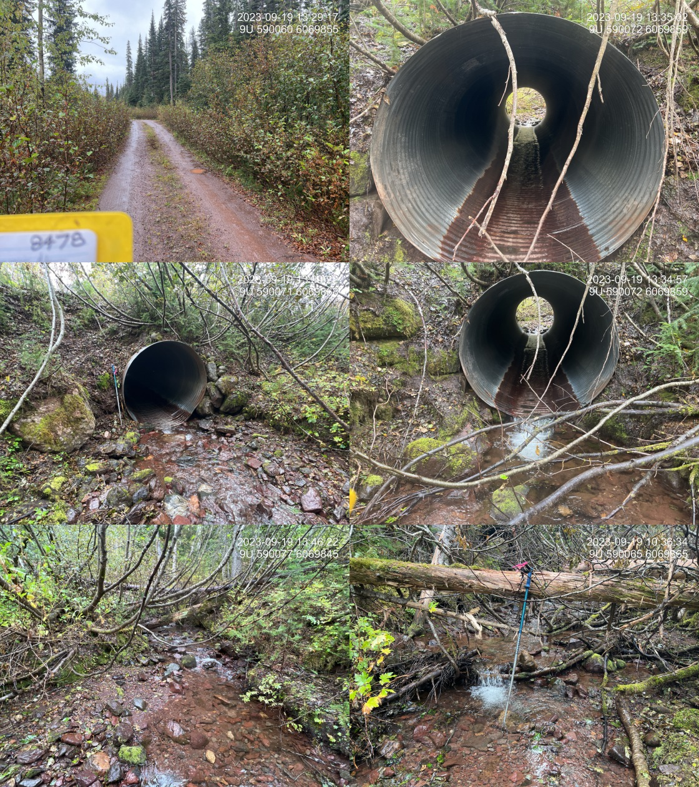

# Data Collection and Field Navigation

## Fish passage assessment methods
In the field, crossings are assessed for fish passage following the procedures outlined in [Field Assessment for Determining Fish Passage Status of Closed Bottomed Structures](https://www2.gov.bc.ca/assets/gov/environment/natural-resource-stewardship/land-based-investment/forests-for-tomorrow/field-assessment-for-determining-fish-passage-status-of-cbs.pdf) [@fish_passage_assessments]. There is a link to these methods in the digital field form so you can easily access them while in the field if you have cell service. There is a field form
for this work that can and should be used to collect data in the field as well. As our digital field data collection system is still in development, we are currently minimally populating a paper form as well as the digital form.  We collect more detailed comments and other information on the digital field forms but still rapidly fill out a paper form to ensure we have the data in case of a digital failure.

<br>

```{r methods-mobile, fig.cap = "The methods used for fish passage assessments can be found in the 'Form PSCIS' under 'Methods'", out.width='50%', eval=T}

```


## Mergin Maps 

[Mergin Maps](https://merginmaps.com/) is a geodata platform that allows us to collaborate with others by collecting data in the field and syncing to a shared QGIS project [@merginmaps2023mergin]. Check out the [Mergin Maps documentation](https://merginmaps.com/docs/) for more information.

<br>


We use Mergin Maps on our phones to locate sites, understand watershed/land values and collect data through digital field forms (adapted versions of the [Field Assessment for Determining Fish Passage Status of Closed Bottomed Structures](https://www2.gov.bc.ca/assets/gov/environment/natural-resource-stewardship/land-based-investment/forests-for-tomorrow/field-assessment-for-determining-fish-passage-status-of-cbs.pdf) [@fish_passage_assessments]. 

<br>

Once downloaded to a phone - wifi or cell service is not required to view maps and collect data. Also of note - it is not required to have the project downloaded on a laptop to see/use them on the phone - only a Mergin account with access to the `newgraph` workspace is necessary.

### Set up

Setting up Mergin Maps on a phone requires a wifi or cell connection:

  1. Download the Mergin Maps app from the App Store (Apple) or Google Play (Android) following the [instructions here](https://merginmaps.com/docs/setup/install-mobile-app/). 
  2. Sign up for a "free trial" account. We suggest a username with no spaces (or special characters like %$&) such as "mwmt_isharpe" as it tells us a lot just by the name. If you have already made a username for github and it has no spaces or special characters perhaps you just want to use that one. Sign in if you have an existing account.
  3. It will require you to make a FREE trial workspace. Once this is complete you will be able to access the `newgraph` workspace at no cost (even beyond the end of the free trial period).
  4. We will receive an invitation to join the `newgraph` Mergin workspace.
  5. Switch to the `newgraph` workspace following [these instructions](https://merginmaps.com/docs/manage/workspaces/#how-to-switch-between-workspaces).
  

### Using Mergin on a mobile device

Although use in the field does not require wifi or cell service, there are actions that require an internet connection such as switching accounts, downloading projects from the cloud, synchronising changes to the cloud, and displaying online background maps (ex. google imagery). Use the following instructions to **download your projects before you head out into the field!**


  1. Navigate to the Projects tab following the [instructions here](https://merginmaps.com/docs/field/mobile-app-ui/#projects).
  2. Download the project you want to view. You will need at least 2GB of storage on your phone to download a project. Once downloaded, tap the project name to open.
  3. [View the different themes](https://merginmaps.com/docs/field/mobile-app-ui/#more-options-zoom-to-project-map-themes-position-tracking-local-changes-settings) available. 
  4. [View the available layers](https://merginmaps.com/docs/field/mobile-app-ui/#layers). You will only see one layer visible, `bcfishpass Mobile`, which contains all our layers grouped into categories. Click `bcfishpass Mobile` to view the categories, such as `Crossings`, `Forms`, `Project Specific`. Some category contains sub-categories, so have a look around to see all the available layers. Toggle a layer to turn it on of off on the map.
    For example, if I want to make the `streams_st` layer visible, I would navigate through `bcfishpass Mobile` → `Streams` → ` Habitat models`→ `streams_st` to toggle on `streams_st`.
  
  5. Know how to [exit](https://merginmaps.com/docs/field/mobile-app-ui/#more-options-zoom-to-project-map-themes-position-tracking-local-changes-setting) a Project.


### Field Data Entry into Mergin
Follow the [instructions to add a feature to a specific layer](https://merginmaps.com/docs/field/mobile-app-ui/#add) and the
guidance below to add fish passage assessment data to the project:

  1. Ensure you are at the location of the culvert before adding the feature to `Form PSCIS`. 
  2. Tap `record` at the bottom of the screen.
  3. Once the form appears you can enter the data. The form is divided into sections which you can see at the top of the screen. The `Stream` and `Climate` sections will only become visible if you have selected `closed bottom structure` for the  `crossing type` because only closed bottom structures require that information. Navigate through each section to enter data.
  4. Click the green check mark in the top right corner to save the feature.
 
```{r sections-mobile, fig.cap = "The `Stream` and `Climate` sections will only become visible if you have selected `closed bottom structure` for the  `crossing type` ", out.width='50%', eval=T}
knitr::include_graphics("fig/fieldwork/more_sections.jpg")
```

  5. While entering information save the form often as glitches can occur which can lead to loosing work.
  
  6. When you are no longer offline, **[make sure to sync](https://merginmaps.com/docs/field/mobile-app-ui/#sync) your changes!** to the online shared project.


When adding features (sites) to the project map, here are some things to take note of:

  - We find that Mergin works much better (faster rendering) with *airplane* mode on. 
  
  - In addition to using the digital field forms (see above section), **make sure to fill out the paper copies as well** as in the past we have seen uncommon issues with syncing and data corruption.
  
  - Switching between themes can be very useful for seeing different levels of detail in the field. Some of the common themes we use are: ADD COMMON THEMES!!

  - The `site_id` is important:
    - If a site has a `PSCIS ID` then that is used as the identifier. 
    
    - If there is no `PSCIS ID` we use the "Crossing - Modelled ID" (a.k.a "My Crossing Reference") as the "Modelled ID". If there is neither (rare but usually occurs when a stream is not mapped) we use a numeric ID based on the date (YYYYMMDD01 - example 2023070502 - would be our second assessment for the day).
  
  - If there is an associated` chris_culvert_id` ("MoTi" identifier) we include that as well.
  
  
Always collect the all the information, including the photos, so that we have what we need. If you don't collect some information then write in the assessment comments why it is missing. For example, if you cannot see the inlet of the culvert, take a picture of what you can see and upload it to Mergin then explain in the assessment comments that the inlet was not visible. Same with fields you are not sure of, fill everything out and put details in the assessment comments of what is going on. It's important that each of the photos uploaded be different, using the same photo for more than one section (ex. Outlet photo and Barrel Photo) creates data management issues.
  
### Assessment Comments

It's important to write detailed comments in the `Assessment Comments" section of the form. Comments should include everything that will helps characterize the site and justify the habitat ratings given by the surveyor. Some example are:

- justification for habitat value rating (ex. good flow and some gravels present)
- the condition of the culvert/crossing
- observations of riparian health or deterioration and potential causes (cattle, erosion, stream velocity, etc)
- Size, number and species (if known) of fish observed 
- location of the crossing if it was incorrectly mapped
- reasons for photos taken are not ideal (ex. water too high to see the inlet so it is not clear in the photo)

  
### Photos

Photos are one of the most important pieces of data we collect with the majority of which loaded to our digital field forms. The [Timestamp Camera app](http://www.timestampcamera.com/) is used to take photos (landscape only) in the field. Ensure the current date and time and UTM coordinates are in top right corner using the settings in Figure \@ref(fig:timestamp-settings), take the photos on the camera first - then load to the field form after (for backup).


```{r timestamp-settings, fig.cap = "Left: Navigate to the Timestamp settings by pressing the 'clock' icon in the bottom right corner. Right: Timestamp UTM and time display settings.", fig.show="hold", out.width= c("49.5%","1%","49.5%"), }

knitr::include_graphics("fig/pixel.png")
knitr::include_graphics("fig/fieldwork/timestamp_settings.JPG")
```

Photos are taken at surveyed crossings and all SIX of the following images are always required: **road, crossing inlet, crossing outlet, crossing barrel, channel downstream and channel upstream of the crossing** (Figure \@ref(fig:timestamp-settings)). Take photos on the camera first then add to the digital field form in the photos sections following the instructions below:
  2. Navigate to the `Photos` section of the digital field form
  3. You will see a place to add each photo under the correct name (Ex: Road photo, Barrel Photo, etc)
  4. Add photos` From Gallery`
  5. **Do not use the same photo for more than one section** (Ex: Upstream photo and Inlet Photo) because this creates data management issues.

```{r photos-mobile, fig.cap = "Left: Under the correct heading (Road photo, Barrel Photo, etc), add each photo 'From Gallery' in the photos section of the digital field form, Right:Examples of six required pohtos.  From top left clockwise: Road/Site Card, Barrel, Outlet, Downstream, Upstream, Inlet.", fig.show="hold", out.width= c("49.5%","1%","49.5%"), }
knitr::include_graphics("fig/fieldwork/photos_mobile.jpg")
knitr::include_graphics("fig/pixel.png")

```
  
```{r photos-mobile2, fig.cap = "Under the correct heading (Road photo, Barrel Photo, etc), add each photo 'From Gallery' in the photos section of the digital field form", out.width='50%', eval=F}

knitr::include_graphics("fig/fieldwork/photos_mobile.jpg")
```

Below are some tips for taking proper photos:

  - Use the TimeStamp app with the correct settings and ALWAYS orient camera landscape when taking photos. This is because of the way the photos are processed for reporting.
  - The first photo you take should always be of the road with the `site_id` on the site card visible in the corner (or a photo of site card filled in with site name, date, stream name).  This allows sorting of photos based on site for all photos transfered from 
  the phone to the cloud or hardrive. 
  - Include something for scale.  We use ski poles for safety navigating in slippery uneven streambeds and to measure depth so one of the poles can be used for scale in the photos. This can come in very handy for understanding stream and crossing structure characteristics just by reviewing the photos.
  - It is important to let the App “find” where you are before taking the first photos at a new site.  It can take a few seconds for the app to zoom into the location where you are standing once it is opened.
  - Closing the app every time you use it will help your phone battery not drain.
  
```{r road-photo, fig.cap = "Examples of six required pohtos.  From top left clockwise: Road/Site Card, Barrel, Outlet, Downstream, Upstream, Inlet.",eval=F}

```
  

<br>


<br>


Ensuring photos are stored and backed up appropriately in case anything goes wrong is very important. We store photos in 3 places:

  1. On your phone in your photos app
  2. In Mergin on the digital field forms for each site as explained above
  3. On a cloud based service such as icloud or google photos, etc. You will likely have to pay for more storage to handle all the photos. Make sure you **sync** your photos to the cloud when are are back in service.
  
Photos should also be taken of the paper field forms at the end of the day. 


## Phone and battery management

- Your phone needs to be mounted on a secure mount on the dash of your vehicle so you can see the phone while driving. 
- Always plug in your phone when driving so it can charge. 
- Always carry an external battery pack so that you can charge your phone if it dies. 
- Ensure your phone is in a quality case.
- Make sure you have enough storage available to take lots of photos!

  
## Backup Maps for Field Navigation
We want to get the job done no matter what. In many areas that we work we have backup pdf maps that allow us to navigate
to sites regardless of whether Mergin is operational or not (usually is but every once in a while technical challenges can occur).

<br>

If pdf maps are available for a watershed group they are located at https://hillcrestgeo.ca/outgoing/fishpassage/projects/ .  The 
maps are organized by watershed group code (ex. BULK is the Bulkley River watershed group, and KISP is the Kispiox River watershed group)

<br>

In order to navigate using our pdf maps we use [Avenza Maps](https://store.avenza.com/) is key for loading georeferenced pdf field maps from <>. We also add `kml` files of our target sites (taken from safety plans) to `Avenza` to make navigation easy. The paid version is necessary to load many maps at the same time for big projects.


<br>


In order to get the pdf maps from the Hillcrest server to our phones we use [Dropbox](https://www.dropbox.com/).  The maps are first 
downloaded to dropbox - then loaded to the phone through the dropbox app.

```{r}
# 4. [Garmin BaseCamp](https://www.garmin.com/en-CA/software/basecamp/) is used to move `gpx` files in and out of our gps. We export tracks out of `Basemap` with the track names unchanged and we name the `gpx` files informatively (see screenshot below for example). **Note: The gps units have a little \$150 micro sd card behind the batteries that can come loose, this chip is key to knowing where we are going. Be careful when changing batteries.**
```


