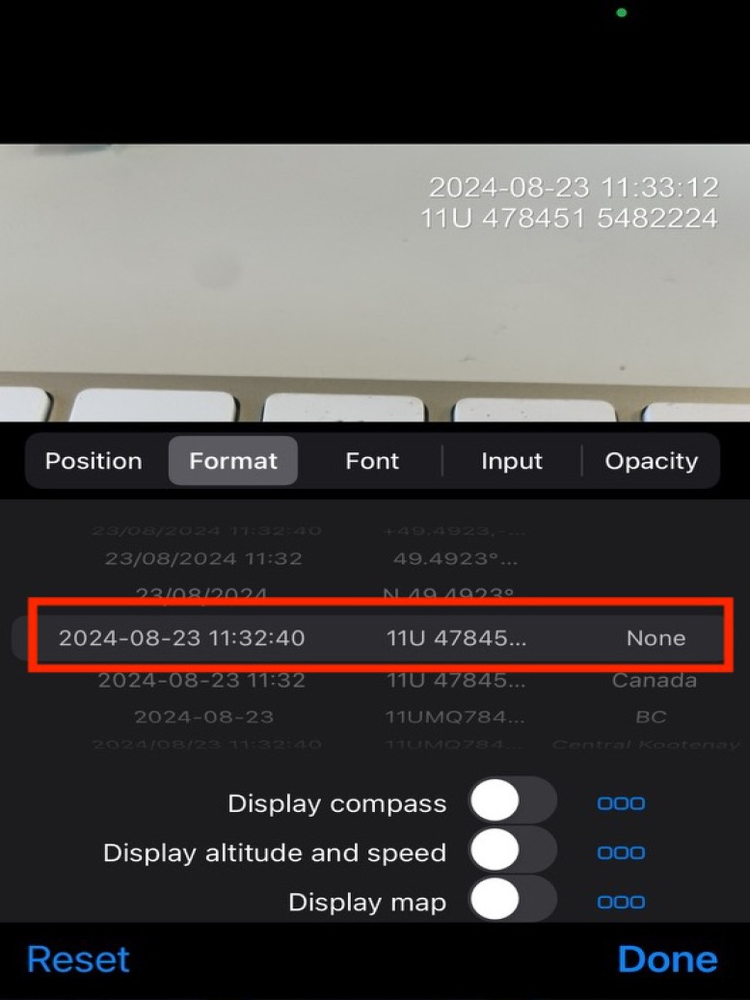

# Data Collection and Field Navigation

When in the field, we use Mergin Maps on our phones to visual the area, but also to add data to the map through digital field forms. This allows us to locate upstream and downstream features such as crossings, barriers, and fish observation. We can also use it to determine the type of surrounding habitat and land use, as well as what type of habitat the stream is modeled as in [bcfishpass](https://smnorris.github.io/bcfishpass/)[@norris2024smnorrisbcfishpass]. 

<br>

[Mergin Maps](https://merginmaps.com/) is a geodata platform that allows us to collaborate with others by collecting data in the field and syncing to a shared QGIS project [@merginmaps2023mergin]. Check out the [Mergin Maps documentation](https://merginmaps.com/docs/) for more information.


## Apps and Programs Used

1. [Timestamp Camera](http://www.timestampcamera.com/) is used to take photos (landscape only) in the field. Ensure the current date and time and UTM coordinates are in top right corner using the settings below. 

```{r timestamp, fig.cap = "Navigate to the Timestamp settings by pressing the "clock" icon in the bottom right corner",eval=T}

# fpr::fpr_photo_resize_convert(photo = "/Users/lucyschick/Projects/repo/fish_passage_guidebook/fig/fieldwork/timestamp_settings_access.jpg", path = "/Users/lucyschick/Projects/repo/fish_passage_guidebook/fig/fieldwork/timestamp_settings_access.jpg")

knitr::include_graphics("fig/fieldwork/timestamp_settings_access.jpg")

```

```{r timestamp, fig.cap = "Timestamp settings",eval=T}

# fpr::fpr_photo_resize_convert(photo = "/Users/lucyschick/Projects/repo/fish_passage_guidebook/fig/fieldwork/timestamp_settings.jpg", path = "/Users/lucyschick/Projects/repo/fish_passage_guidebook/fig/fieldwork/timestamp_settings.jpg")



```

2. [Avenza Maps](https://store.avenza.com/) is key for loading georeferenced pdf field maps from <https://hillcrestgeo.ca/outgoing/fishpassage/projects/>. We also add `kml` files of our target sites (taken from safety plans) to `Avenza` to make navigation easy. The paid version is necessary to load many maps at the same time for big projects.

3. [Dropbox](https://www.dropbox.com/) is used for bulk uploads to `Avenza.`

4. [Garmin BaseCamp](https://www.garmin.com/en-CA/software/basecamp/) is used to move `gpx` files in and out of our gps. We export tracks out of `Basemap` with the track names unchanged and we name the `gpx` files informatively (see screenshot below for example). **Note: The gps units have a little \$150 micro sd card behind the batteries that can come loose, this chip is key to knowing where we are going. Be careful when changing batteries.**

## Mergin Maps 

Mergin is handy because we don't need wifi or cell service to view the maps. You don’t need to have the project downloaded on your laptops to see/use them on your phone, you just need to have a Mergin account with access to the `newgraph` workspace.

### Set up

Set up Mergin Maps on your phone. This must be done with wifi or while in cell range (not offline):

  1. Download the Mergin Maps app from the App Store (Apple) or Google Play (Android) following the [instructions here](https://merginmaps.com/docs/setup/install-mobile-app/). You don’t need to have the project on your laptops to see/use on your phone.
  2. Sign up for a "free trial" account. We suggest a username with no spaces (or special characters like %$&) such as "mwmt_isharpe" as it tells us a lot just by the name. If you have already made a username for github and it has no spaces or special characters perhaps you just want to use that one. Sign in if you have an existing account.
  3. It will require you to make a trial workspace, once this is complete you will be able to access the `newgraph` workspace at no cost (even beyond the free trial period).
  4. We will send you an invitation to join the `newgraph` Mergin workspace.
  5. Switch to the `newgraph` workspace following [these instructions](https://merginmaps.com/docs/manage/workspaces/#how-to-switch-between-workspaces).
  

### Using Mergin on your mobile device

Mergin is great because we can use it in the field without wifi or cell service. However, there are some actions that require internet connection and cannot be done offline, such as switching accounts, downloading projects from the cloud, synchronising changes to the cloud, or displaying online background maps. Use the following instructions to **download your projects before you head out into the field!**


  1. Navigate to the Projects tab following the [instructions here](https://merginmaps.com/docs/field/mobile-app-ui/#projects).
  2. Download the project you want to view. You will need at least 2GB of storage on your phone to download a project. Once downloaded, tap the project name to open.
  3. [View the different themes](https://merginmaps.com/docs/field/mobile-app-ui/#more-options-zoom-to-project-map-themes-position-tracking-local-changes-settings) available. 
  4. [View the available layers](https://merginmaps.com/docs/field/mobile-app-ui/#layers). You will only see one layer visible, `bcfishpass Mobile`, which contains all our layers grouped into categories. Click `bcfishpass Mobile` to view the categories, such as `Crossings`, `Forms`, `Project Specific`. Some category contains sub-categories, so have a look around to see all the available layers. Toggle a layer to turn it on of off on the map.
    For example, if I want to make the `streams_st` layer visible, I would navigate through `bcfishpass Mobile` → `Streams` → ` Habitat models`→ `streams_st` to toggle on `streams_st`.
  
  5. Know how to [exit](https://merginmaps.com/docs/field/mobile-app-ui/#more-options-zoom-to-project-map-themes-position-tracking-local-changes-setting) a Project.


### Field Data Entry into Mergin
  

We have digital field forms through Mergin Maps that allow you to add features and data to the map while in the field. Most of the time we don't have service, so we just save our Projects often and then once back in service we sync with the cloud. Follow the instructions below to add a feature (site) to the project map:

  1. Follow the [instructions add a feature](https://merginmaps.com/docs/field/mobile-app-ui/#add).
  2. Ensure you are adding the feature to the correct layer, most likely `Form PSCIS` or `Form FISS Site`. Then tap `record` at the bottom of the screen.
  3. Next, a form will appear and you can enter the data. The form is divided into sections which you can see at the top of the screen. Navigate through each section to enter data.
 
```{r features-mobile, fig.cap = "Features form is divided into sections at the top of the screen",eval=T}
knitr::include_graphics("fig/mapping/features_mobile.PNG")
```

  4. Save the forms as often as possible so if it glitches or fails you don't lose your work.
  
  5. When you are no longer offline, **make sure to [sync](https://merginmaps.com/docs/field/mobile-app-ui/#sync) your changes!**

<br>

When adding features (sites) to the project map, here are some things to take note of:

  - We find that Mergin works much better (faster rendering) with *airplane* mode on. 
  
  - In addition to using the digital field forms (see above section), **make sure to fill out the paper copies as well** because over the last year we have seen uncommon issues with syncing and data corruption.
  
  - Switching between themes can be very useful for seeing different levels of detail in the field. Some of the commong themes we use are: ADD COMMON THEMESE!!

  - The `site_id` is important:
    - If a site has a `PSCIS ID` then that is used as the identifier. 
    
    - If there is no `PSCIS ID` we use the "Crossing - Modelled ID" (a.k.a "My Crossing Reference") as the "Modelled ID". If there is neither (rare but usually occurs when a stream is not mapped) we use a numeric ID based on the date (YYYYMMDD01 - example 2023070502 - would be our second assessment for today).
  
  - If there is an associated` chris_culvert_id` ("MoTi" identifier) we include that as well.
  
## Fish passage assessment methods

In the field, crossings are assessed for fish passage following the procedures outlined in [Field Assessment for Determining Fish Passage Status of Closed Bottomed Structures]() [@fish_passage_assessments]. All data should be entered using the digital field forms in Mergin Maps. Please see [Field Data Entry into Mergin] for how to enter data into Mergin. 

Photos are taken at surveyed crossings and when possible included images of the road, crossing inlet, crossing outlet, crossing barrel, channel downstream and channel upstream of the crossing and any other relevant features, in that order. See [Photos] for how to take proper photos.

The following information should be recorded and entered into Mergin Maps for all surveyed crossings. The list below is an example of what information is included in the digital field forms in Mergin:

  - date of inspection
  - crossing reference 
  - crew member initials
  - Universal Transverse Mercator (UTM) coordinates
  - stream name
  - road name and kilometer
  - road tenure information
  - crossing type
  - crossing subtype
  - culvert diameter or span for OBS (Open Bottom Structure)
  - culvert length or width for OBS


A more detailed “full assessment” should be completed for all closed bottom structures and included the following parameters: 

  - presence/absence of continuous culvert embedment (yes/no) 
  - average depth of embedment 
  - whether or not the culvert bed resembled the native stream bed 
  - presence of and percentage backwatering 
  - fill depth 
  - outlet drop  
  - outlet pool depth
  - inlet drop
  - culvert slope 
  - average downstream channel width 
  - stream slope 
  - presence/absence of beaver activity 
  - presence/absence of fish at time of survey
  - type of valley fill 
  - habitat value rating  

Habitat value ratings are based on channel morphology, flow characteristics (perennial, intermittent, ephemeral), fish migration patterns, the presence/absence of deep pools, un-embedded boulders, substrate, woody debris, undercut banks, aquatic vegetation and overhanging riparian vegetation (Table \@ref(tab:tab-hab-value)).

```{r tab-hab-value}
fpr_table_habvalue %>% 
  knitr::kable(caption = 'Habitat value criteria (Fish Passage Technical Working Group, 2011).', booktabs = T) %>% 
    kableExtra::column_spec(column = 1, width_min = '1.5in') %>% 
    kableExtra::kable_styling(c("condensed"), full_width = T, font_size = font_set) 
  
```

  
## Photos

Taking proper photos is important for visualizing the site, data QA, and the quality of our report. See the [Apps and Programs Used] sections to download the TimeStamp app. Below are some tips for taking proper photos:


- Use the TimeStamp app
- Ensure the current time and UTM coordinates in top right corner, see settings in [Apps and Programs Used] for how to set this up. See photo below for proper coordinates. 
- Orient camera landscape when taking photos.
- The first photo you take should always be of the road with the `site_id` on the site card visible in the corner (or a photo of site card filled in with site name, date, stream name) so that it is easy/possible to know which photos come from where.

```{r road-photo, fig.cap = "The first photo should always of the road with the `site_id` on the site card visible in the corner",eval=T}
knitr::include_graphics("fig/fieldwork/road_photo.png")
```
- It is important to let the App “find” where you are before taking the first photos at a new site.  It can take a few seconds for the app to zoom into the location where you are standing once it is opened.
- Closing the app every time you use it will help your phone battery not drain.


## Phone and battery management

- Your phone needs to be mounted on a secure mount on the dash of your vehicle so you can see the phone while driving. 
- Always plug in your phone when driving so it can charge. 
- Always carry an external battery pack so that you can charge your phone if it dies. 
- Ensure your phone is in a quality case.

Need some sort of cloud backup so that photos sync to the cloud each night. they are on phone AND in mergin. At end of day take photos in order of all field pages

  
  

