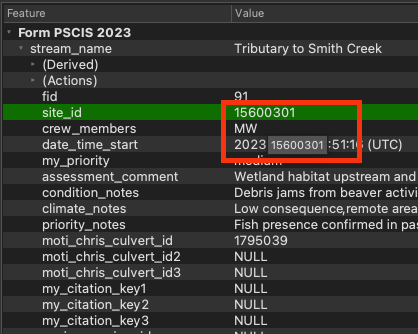

# Mapping

We use QGIS, and Mergin Maps for our fish passage data management and analysis. Before heading out into the field, we research the area we will be going to by visualizing the area on QGIS. This allows us to locate upstream and downstream features such as crossings, barriers, and fish observation. We can also use it to determine the type of surrounding habitat and land use, as well as what type of habitat the stream is modeled as in [bcfishpass](https://smnorris.github.io/bcfishpass/)[@norris2024smnorrisbcfishpass]. When in the field, we use Mergin Maps on our phones to visual the same data, but also to add data to the map through digital field forms. 

<br>

[QGIS](https://qgis.org/) (Quantum Geographic Information System) is a free, open-source software that allows users to create, edit, visualize, analyze, and publish geospatial information [@qgisdevelopmentteam2009QGISgeographic]. [Mergin Maps](https://merginmaps.com/) is a geodata platform that allows us to collaborate with others by collecting data in the field and syncing to a shared QGIS project [@merginmaps2023mergin]. Check out the [Mergin Maps documentation](https://merginmaps.com/docs/) for more information.

<br>

This section will get you started with all our mapping procedures.


## Mergin on your computer

Map creation, research, planning, and data QA takes place using QGIS and Mergin Maps on our computers.

### Set up

Set up QGIS on your computer:

* Follow this link to the [QGIS Download Page](https://www.qgis.org/en/site/forusers/download.html) to install the latest version.

* Here is some great info for getting up to speed with the [basics of QGIS](https://courses.spatialthoughts.com/introduction-to-qgis.html).

<br>

Set up Mergin Maps with QGIS on your laptop:

  1. Follow the instruction to [sign up for a free mergin account](https://merginmaps.com/docs/setup/sign-up-to-mergin-maps/).
  
  2. Make sure you have the latest version of QGIS installed.
  
  3. Install the [Mergin Maps plugin](https://merginmaps.com/docs/setup/install-mergin-maps-plugin-for-qgis/).
  
  4. We will send you an invitation to join the `newgraph` Mergin workspace.
  

### View projects in QGIS
  
  1. Switch to the `newgraph` workspace in QGIS following [these instructions](https://merginmaps.com/docs/manage/workspaces/#switch-workspaces-in-qgis). Our project will show up in the `Mergin Maps` tab of the `Browser` window.
  
```{r mergin-projects, fig.cap = "Viewing New Graph's Mergin projects",eval=T}
knitr::include_graphics("fig/mapping/mergin_projects.png")
```

  
  2. Right click the project name and select `Download`. 
  
  3. Save the project somewhere appropriate. For New Graph employees this should be `Projects/gis`.
  
  4. Double click or right click to open the project. 
  

### Common actions in QGIS

Below are some common actions we use in QGIS:

  1. We use `themes` to simplifying viewing projects. You can select a `theme` by clicking the "eye" icon in `Layers` panel. You can also add `themes` following the [instructions here](https://merginmaps.com/docs/gis/setup_themes/#setting-up-qgis-map-themes). 
  
```{r themes, fig.cap = "How select themes in QGIS",eval=T}

```
  
  2. Finding a feature such as a culvert, stream, or else anything on the map. Use `Select feature by value`. Then input your search term and select `zoom to feature`, for example, looking for the site with `site_id = 15600301`. 
  
```{r find-feature, fig.cap = "How to finding features in QGIS",eval=T}
knitr::include_graphics("fig/mapping/finding_feature.png")
knitr::include_graphics("fig/mapping/site_search.png")
```

  3. Getting information about a feature ("Identify Feature"). Make sure you have the layer selected in the `layer` panel, then select the `Identify Features` tool (top right) and click on the feature you want to know more about. The` Identify Results` panel will appear on the right. 

```{r identify-feature, fig.cap = "How to see feature info in QGIS",eval=T}
knitr::include_graphics("fig/mapping/identify_feature.png")
```
 
  4. Copy information from a feature. Select the row then hover your cursor over the text you want to copy then `cmd+c` to copy (on mac).

```{r copy-feature, fig.cap = "How to copy information from a features in QGIS",eval=T}

```

  5. Creating maps with `Projects/print layout`. This is where you can create a map that can be exported as an image or pdf. Below is an example of a map layout. Check out [this video](https://www.youtube.com/watch?v=OlDGEVhpmo0) for how to make maps.

```{r qgis-maps, fig.cap = "How to create and export maps in QGIS",eval=T}

```
  

### Editing a Project

- Sync the project [following these instructions](https://merginmaps.com/docs/manage/synchronisation/#how-to-synchronise-changes-in-mergin-maps) before making any edits to make sure you have the most up to date version of the project. Others may have edited the project since you last opened it.

- Make sure to sync the project [following these instructions](https://merginmaps.com/docs/manage/synchronisation/#how-to-synchronise-changes-in-mergin-maps) after making any edits.

<!-- ### Labelling -->

<!-- It is important to develop workflows to streamline labeling and avoid hand work in the map layout viewer. Helpful details and tips include: -->

<!-- * Avoid labeling in the map layout viewer, as soon as your project map changes you have to redo labels. -->
<!-- * Adjust/move labels in the project view, using the abc labels (shown below) -->

<!-- ```{r label, fig.cap = "How to adjust/move labels in the project view", eval=T} -->
<!--  -->
<!-- ``` -->

<!-- * Align labels in project view by using the "View current map extent in main canvas" button in the layout viewer. -->
<!-- * If you need to add labels by hand sometimes you can add a line layer with no symbology and add features with a "label" field. Then you can put them where you want and they will be flexible if you shift your map around. -->
<!-- * Another technique is duplicating layers for a particular layout and changing the label symbology. -->


## Mergin on your mobile device

When in the field, we use Mergin Maps on our phones to visual the data, but also to add data to the map through digital field forms. Mergin is handy because we don't need wifi or cell service to view the maps. You don’t need to have the project downloaded on your laptops to see/use them on your phone, you just need to have a Mergin account with access to the `newgraph` workspace.

### Set up

Set up Mergin Maps on your phone. This must be done with wifi or while in cell range (not offline):

  1. Download the mobile app following the [instructions here](https://merginmaps.com/docs/setup/install-mobile-app/).
  2. Sign in.
  3. If required, switch to the `newgraph` workspace following [these instructions](https://merginmaps.com/docs/manage/workspaces/#how-to-switch-between-workspaces).
  

### Using Mergin on your mobile device

Mergin is great because we can use it in the field without wifi or cell service. However, there are some actions that require internet connection and cannot be done offline, such as switching accounts, downloading projects from the cloud, synchronising changes to the cloud, or displaying online background maps. Use the following instructions to **download your projects before you head out into the field!**


  1. Navigate to the Projects tab following the [instructions here](https://merginmaps.com/docs/field/mobile-app-ui/#projects).
  2. Download the project you want to view. Once downloaded, tap the project name to open.
  3. [View the different themes](https://merginmaps.com/docs/field/mobile-app-ui/#more-options-zoom-to-project-map-themes-position-tracking-local-changes-settings) available. 
  4. [View the available layers](https://merginmaps.com/docs/field/mobile-app-ui/#layers). You will only see one layer visible, `bcfishpass Mobile`, which contains all our layers grouped into categories. Click `bcfishpass Mobile` to view the categories, such as `Crossings`, `Forms`, `Project Specific`. Some category contains sub-categories, so have a look around to see all the available layers. Toggle a layer to turn it on of off on the map.
    For example, if I want to make the `streams_st` layer visible, I would navigate through `bcfishpass Mobile` → `Streams` → ` Habitat models`→ `streams_st` to toggle on `streams_st`.
  
  5. Know how to [exit](https://merginmaps.com/docs/field/mobile-app-ui/#more-options-zoom-to-project-map-themes-position-tracking-local-changes-setting) a Project.


### Field Data Entry into Mergin
  

We have digital field forms through Mergin Maps that allow you to add features and data to the map while in the field. Most of the time we don't have service, so we just save our Projects often and then once back in service we sync with the cloud. Follow the instructions below to add a feature (site) to the project map:

  1. Follow the [instructions add a feature](https://merginmaps.com/docs/field/mobile-app-ui/#add).
  2. Ensure you are adding the feature to the correct layer, most likely `Form PSCIS` or `Form FISS Site`. Then tap `record` at the bottom of the screen.
  3. Next, a form will appear and you can enter the data. The form is divided into sections which you can see at the top of the screen. Navigate through each section to enter data.
 
```{r features-mobile, fig.cap = "Features form is divided into sections at the top of the screen",eval=T}
knitr::include_graphics("fig/mapping/features_mobile.PNG")
```

  4. Save the forms as often as possible so if it glitches or fails you don't lose your work.
  
  5. When you are no longer offline, **make sure to [sync](https://merginmaps.com/docs/field/mobile-app-ui/#sync) your changes!**

<br>

When adding features (sites) to the project map, here are some things to take note of:

  - We find that Mergin works much better (faster rendering) with *airplane* mode on. 
  
  - In addition to using the digital field forms (see above section), **make sure to fill out the paper copies as well** because over the last year we have seen uncommon issues with syncing and data corruption.
  
  - Switching between themes can be very useful for seeing different levels of detail in the field. Some of the commong themes we use are: ADD COMMON THEMESE!!

  - The `site_id` is important:
    - If a site has a `PSCIS ID` then that is used as the identifier. 
    
    - If there is no `PSCIS ID` we use the "Crossing - Modelled ID" (a.k.a "My Crossing Reference") as the "Modelled ID". If there is neither (rare but usually occurs when a stream is not mapped) we use a numeric ID based on the date (YYYYMMDD01 - example 2023070502 - would be our second assessment for today).
  
  - If there is an associated` chris_culvert_id` ("MoTi" identifier) we include that as well.
  

<!--  Site visit schedule: -->

<!-- - When we first arrive at a site we take a photo of the road with the PSCIS ID or Modelled ID in the corner. This allows easy reference to which photos are for which sites. When we are done filling out the paper form we take a photo of it (for data backup and to make it easy to see which photos are from where). -->

<!-- Other stuff: -->

<!--  - There are links to the methods docs in the forms with the intention that you can save them to your phone.  Obviously, the provincial method documents are key. CAN'T SEE THIS YET?? -->

<!-- - At this point in time the climate change metrics are a touch subjective and poorly defined.  We will be refining them later but for now it is effective for comparing one site to the next. Keen on your feedback as this was passed on to us as is and we have some ideas too about ways to simplify/standardize things. -->

<!-- - The "FDS" and "Site Card/Fish form" stuff in the "ignore_mobile/templates" directory are what we use for Habitat Confirmation (Phase 2) work as it allows us to standardize data collection and upload more detailed habitat/fish information to the province.   -->


## Project Creation

- Project creation is done with `bcdata.sh` and `background_layers.sh` found in https://github.com/NewGraphEnvironment/dff-2022/tree/master/scripts/qgis.  See the readme for instructions. 

- There is a directory in the project called `ignore_mobile` which contain the site photos. The project directory also contains the methods and templates for paper data collection, as well as the excel files that are used to upload the data to the province. The provincial method documents are obviously key to review, print and have on hand in the field.

- To understand how the modelling for fish habitat works you can [review the settings](https://github.com/smnorris/bcfishpass/blob/main/data/parameters_habitat_thresholds.csv) we use in bcfishpass. We used the channel width method for our projects.

-  the whole setup is quite beta and it is not straightforward at this time to get the data from the form geopackage in QGIS into the templates used for data submission to the province we are using `*_tidy.R` scripts to do that and they are evolving over time here ( https://github.com/NewGraphEnvironment/dff-2022/tree/master/scripts ). 


## LiDAR

Light detection and ranging (LiDAR) is a technology that can be used to create high resolution Digital Elevation Models (DEMs). These DEMs can give us a better idea of what is happening in a watershed at a site of interest. 

* LiDAR point cloud data and DEMs can be found on the [LiDAR BC Portal](https://governmentofbc.maps.arcgis.com/apps/MapSeries/index.html?appid=d06b37979b0c4709b7fcf2a1ed458e03).
* Downloading DEMs is the way to go. However, if there is only LiDAR point cloud data available then you can convert to a DEM. A tutorial on the process can be found on OneDrive [here](https://onedrive.live.com/?cid=D3D3332E1628A93C&id=D3D3332E1628A93C%21291796&parId=D3D3332E1628A93C%21275627&o=OneUp). 
* We can link directly to online data using raster/https connection (example shown in screenshot below)

```{r raster-http, fig.cap = "How to connect to raster in QGIS data source manager",eval=T}

```

