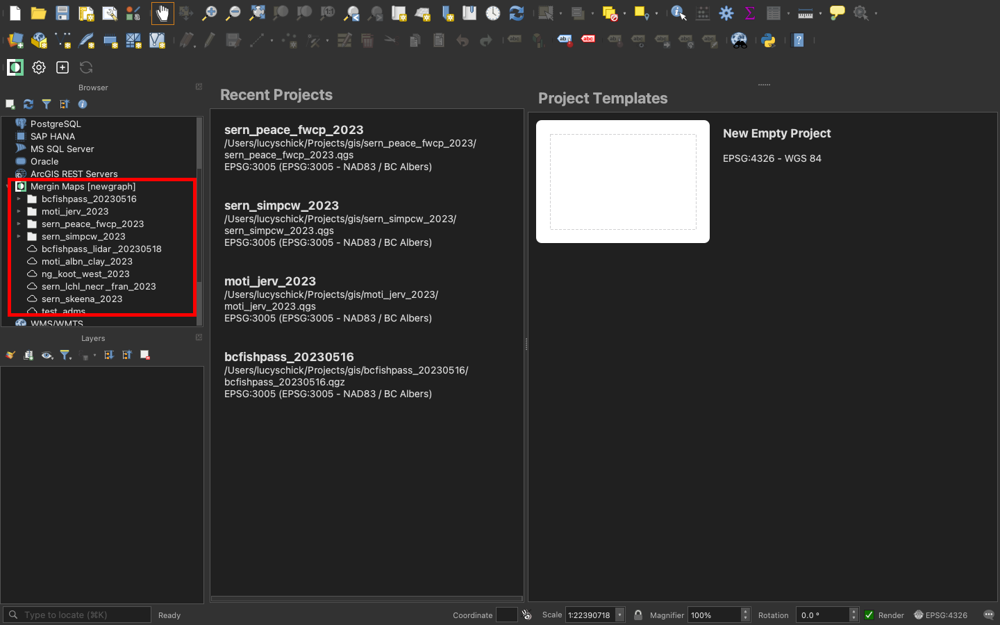
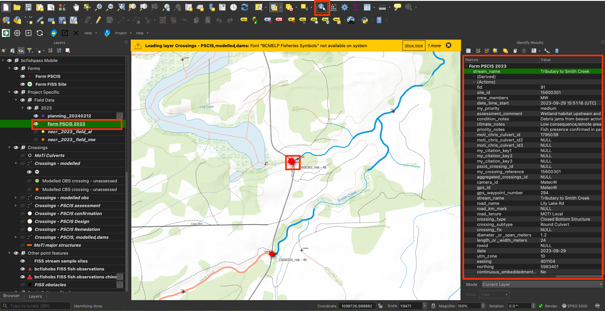

# Planning for the Field

We use QGIS and Mergin Maps for our fish passage preparation, data management and analysis. [QGIS](https://qgis.org/) (Quantum Geographic Information System) is a free, open-source software that allows users to create, edit, visualize, analyze, and publish geospatial information [@qgisdevelopmentteam2009QGISgeographic]. [Mergin Maps](https://merginmaps.com/) is a geodata platform that allows us to collaborate with others by collecting data in the field and syncing to a shared QGIS project [@merginmaps2023mergin]. Check out the [Mergin Maps documentation](https://merginmaps.com/docs/) for more information.

Before heading out into the field, we research the area we will be going to by visualizing the area on QGIS. We want to understand all we can about a site before arriving there. Our QGIS projects include an extensive amount of information that can be relevant for a site, such as information regarding:

  - Land ownership 
  - Past fish observations
  - The conditions of the crossing structure
  - Links to relevant reports  
  - How to access sites
  - Habitat models 
  - Road tenure information

<br>

This section will get you started with all our field preparation procedures.


## Mergin Maps on your computer

Map creation, research, planning, and data QA takes place using QGIS and Mergin Maps on our computers.

### Set up

Set up QGIS on your computer:

* Follow this link to the [QGIS Download Page](https://www.qgis.org/en/site/forusers/download.html) to install the latest version.

* Here is some great info for getting up to speed with the [basics of QGIS](https://courses.spatialthoughts.com/introduction-to-qgis.html).

<br>

Set up Mergin Maps with QGIS on your laptop:

  1. Follow the instruction to [sign up for a free mergin account](https://merginmaps.com/docs/setup/sign-up-to-mergin-maps/).
  
  2. Make sure you have the latest version of QGIS installed.
  
  3. Install the [Mergin Maps plugin](https://merginmaps.com/docs/setup/install-mergin-maps-plugin-for-qgis/).
  
  4. We will send you an invitation to join the `newgraph` Mergin workspace.
  

### View projects in QGIS
  
  1. Switch to the `newgraph` workspace in QGIS following [these instructions](https://merginmaps.com/docs/manage/workspaces/#switch-workspaces-in-qgis). Our project will show up in the `Mergin Maps` tab of the `Browser` window.
  
```{r mergin-projects, fig.cap = "Viewing New Graph's Mergin projects",eval=T}

```

  
  2. Right click the project name and select `Download`. 
  
  3. Save the project somewhere appropriate. For New Graph employees this should be `Projects/gis`.
  
  4. Double click or right click to open the project. 
  

### Common actions in QGIS

Below are some common actions we use in QGIS.

Most of the time we will have the attributes table open for a layer and will be navigating to features from there, you can find lots of information about [working with attributes tables here](https://docs.qgis.org/3.34/en/docs/user_manual/working_with_vector/attribute_table.html#working-with-the-attribute-table).

  - We use `themes` to simplifying viewing projects. You can select a `theme` by clicking the "eye" icon in `Layers` panel. You can also add `themes` following the [instructions here](https://merginmaps.com/docs/gis/setup_themes/#setting-up-qgis-map-themes). 
  
```{r themes, fig.cap = "How select themes in QGIS",eval=T}
knitr::include_graphics("fig/planning/themes.png")
```
  
  - [Open the attributes table](https://docs.qgis.org/3.34/en/docs/user_manual/working_with_vector/attribute_table.html#introducing-the-attribute-table-interface), and doc it so it is visible on the same screen as the map using the icon below. 
  
```{r doc-attributes, fig.cap = "Select the 'doc attributes table' icon on the top right of the attributes table so it is visible on the same screen as the map",eval=T}

```
  
  - Zoom to a feature from the attributes table by selecting the feature row in the table and then clicking `Zoom to feature` located at the top of the attributes table. This will zoom to the feature on the map and highlight it in yellow.
  
```{r zoom-attributes, fig.cap = "Zoom to a feature from the attributes table",eval=T}
knitr::include_graphics("fig/planning/zoom_attributes.png")
```
  
  - Finding a feature such as a culvert, stream, or else anything on the map. Use `Select feature by value`. Then input your search term and select `zoom to feature`, for example, looking for the site with `site_id = 15600301`. 
  
```{r find-feature, fig.cap = "How to finding features in QGIS",eval=T}

knitr::include_graphics("fig/planning/site_search.png")
```

  - [Getting information about a feature](https://docs.qgis.org/3.34/en/docs/user_manual/working_with_vector/attribute_table.html#exploring-features-attributes-through-the-identify-tool) ("Identify Feature"). Make sure you have the layer selected in the `layer` panel, then select the `Identify Features` tool (top right) and click on the feature you want to know more about. The` Identify Results` panel will appear on the right.

```{r identify-feature, fig.cap = "How to see feature info in QGIS",eval=T}

```
 
  - Copy information from a feature. Select the row then hover your cursor over the text you want to copy then `cmd+c` to copy (on mac).

```{r copy-feature, fig.cap = "How to copy information from a features in QGIS",eval=T}
knitr::include_graphics("fig/planning/copy_feature_info.png")
```

  - View the digital field forms. Forms are available for many layer but we have created special categorized forms for the `form_pscis` and `form_fiss_site` layers because these are the layers we add data (sites) to. Select one of these layers, use the `Identify Results` tool to pull up the crossing's information, then click the `form` icon located in the top left corner of the `Identify Results` panel. A new window will pop up with the form.  
  
```{r forms, fig.cap = "How to view the digital field form for either the `form_pscis` or `form_fiss_site` layers",eval=T}
knitr::include_graphics("fig/planning/forms.png")
```

  - [Measure a distance](https://docs.qgis.org/3.34/en/docs/user_manual/map_views/map_view.html#measure-length-areas-bearings-and-angles-interactively) by selecting the 'ruler' icon located on the top right, then click two points to measure the distance between. A new window will pop up to show the distances. 
  
```{r measure, fig.cap = "How to the distance between two points",eval=T}
knitr::include_graphics("fig/planning/measure.png")
```

- You can view photos from a previously assessed PSCIS site in QGIS by selecting the `Crossings - PSCIS assessment` layer, using the `Identify Results` tool to pull up the crossing's information, then clicking the link from the `image_view_url` field. It will then direct you to a web-page with the site photos.

```{r link-photos, fig.cap = "Access photos from a previously assessed PSCIS crossing ",eval=T}
knitr::include_graphics("fig/planning/link_photos.png")
```


### Editing a Feature

If for some reason you need to add or edit features (this doesn't happen that often), you can do so by [following the instructions here](https://docs.qgis.org/3.34/en/docs/user_manual/working_with_vector/attribute_table.html#editing-multiple-fields). 

Make sure to **sync** the project [following these instructions](https://merginmaps.com/docs/manage/synchronisation/#how-to-synchronise-changes-in-mergin-maps) **before** to ensure that you have the most up to date version of the project (others may have edited the project since you last opened it) and **after** so that other team members will see to your updates.


## Background planning

Before heading out into the field, we research the area we will be going to by visualizing the area on QGIS. We want to understand all we can about a site before arriving there.

Here are some things to investigate for a site, with the corresponding layer on QGIS:

  - All `Crossings - PSCIS` layers - Has the crossing been assessed before? What was it ranked as? Are there other crossings upstream or downstream and have they been assessed?
  - `Land Ownership`- who owns the land. Is the crossing on private land, is it even accessible?
  - `bcfishobs FISS fish observations`- have there been fish observed upstream or downstream in the past?
  - `FISS obstacles`- are there barriers to fish passage noted on the stream?
  - `habitat models`- is the stream modeled at suitable habitat for the target species?
  - What type of habitat is upstream/downstream? Use layers within `Basemap` section
  - `Google Satellite`, `Bing Aerial`- is there a stream or crossing present? 
  - How will you access the crossing? Which roads will you take? How far of a walk will it be from your vehicle to the crossing (use measuring tool on QGIS)


